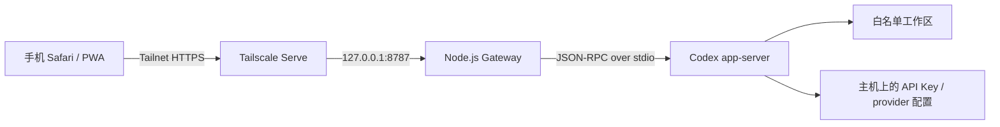

# Codex Mobile

通过 Tailscale 在手机上安全控制主机中的 Codex CLI。项目提供一个轻量 PWA，
把 Codex `app-server` 的任务、审批、附件和权限控制能力映射到手机浏览器。

> 本项目是非官方社区工具，使用 Codex CLI 的实验性 `app-server` 协议。
> Codex CLI 升级后可能需要同步适配。

## 功能

- 新建、恢复和停止 Codex 任务
- 实时显示回复、命令执行和文件变更
- 在手机端处理命令审批与问题输入
- 每条消息默认上传 8 个、单个最大 25 MB 的图片或附件
- 在配置白名单内切换多个工作目录，最近选择会在 Gateway 重启后恢复
- 在同一个网页界面中切换多台独立主机
- 工作区模式与完全访问模式切换
- 配对码登录、30 天签名会话
- Windows 计划任务与 Linux systemd user service 自启动
- Tailscale Serve 提供 Tailnet 内 HTTPS，不开放公网端口

## 架构



API Key、`auth.json`、自定义 provider 配置和模型目录始终留在主机。手机只持有
Tailnet 身份与网关会话 Cookie。

多主机使用联邦式部署：每台主机运行自己的 Gateway 和 Codex，网页选择主机时跳转到该主机的
Tailnet HTTPS 地址。各主机的 API Key、配对码、Cookie、附件和任务数据互不转发。

## 快速安装

准备好 Node.js、Codex CLI、Tailscale，并先确认主机上直接运行 Codex 可以正常回复。

Linux：

```bash
git clone git@github.com:davids1896/Codex-Mobile.git
cd Codex-Mobile
chmod +x scripts/linux/*.sh
./scripts/linux/install.sh --workspace /absolute/path/to/repository
```

Windows PowerShell：

```powershell
git clone git@github.com:davids1896/Codex-Mobile.git
cd Codex-Mobile
Set-ExecutionPolicy -Scope Process Bypass -Force
.\scripts\windows\install.ps1 -Workspace 'D:\path\to\repository'
```

安装器会启动网关、配置自启动、调用 `tailscale serve --bg`，并输出手机首次登录
所需的配对码。然后在手机 Tailscale 中连接同一 Tailnet，打开安装器显示的 HTTPS
地址，并将页面添加到主屏幕。

安装后编辑私有 `config.json` 即可增加 `workspaces` 与 `hosts`。完整格式和多主机同步步骤见
[详细部署教程](docs/DEPLOYMENT.zh-CN.md#6-配置多个工作目录与主机)。

## 文档

- [详细部署教程](docs/DEPLOYMENT.zh-CN.md)
- [架构与数据流](docs/ARCHITECTURE.md)
- [故障排查](docs/TROUBLESHOOTING.zh-CN.md)
- [安全策略](SECURITY.md)
- [Windows SSH 兜底方案](docs/WINDOWS-SSH.zh-CN.md)

## 重要安全提醒

- 不要使用 Tailscale Funnel，不要做公网端口映射。
- 不要把 API Key、`auth.json`、配对码或 Cookie 密钥提交到 Git。
- “完全访问”会关闭逐项审批并允许 Codex 以当前系统用户权限访问整台主机。
- 网关重启后权限会自动恢复为“工作区”。
- 怀疑配对码或手机会话泄漏时，应立即运行配对码轮换脚本。

## License

MIT
