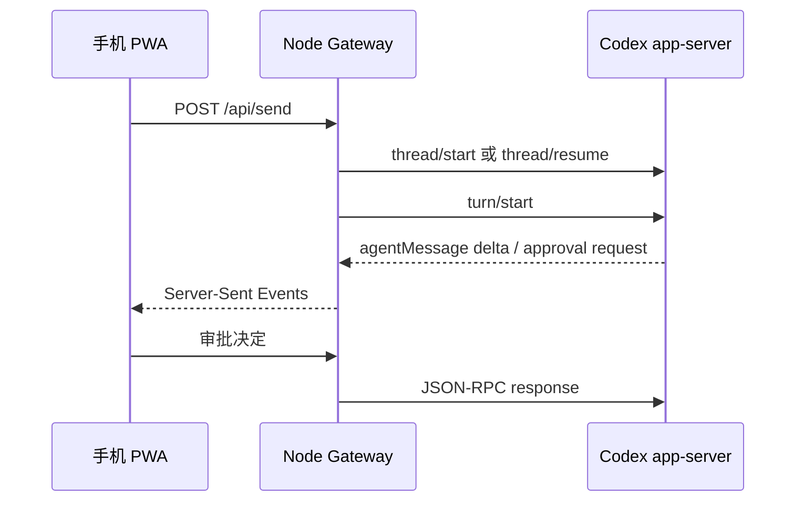

# 架构与数据流

## 组件

1. 手机 PWA：发送文本、附件、审批决定和权限模式。
2. Tailscale Serve：终止 HTTPS，并只向 Tailnet 成员开放。
3. Node.js Gateway：固定监听 `127.0.0.1`，校验配对会话并管理上传文件。
4. Codex app-server：由 Gateway 作为子进程启动，通过逐行 JSON-RPC 通信。
5. Codex 本机配置：API Key、provider、模型目录、任务数据库和插件均由 Codex
   自己读取，Gateway 不复制这些秘密。

## 任务流程

## 附件

- 上传原件保存在私有数据目录的 `uploads/` 中，权限为当前用户可读写。
- 图片作为 `localImage` 输入传给 Codex。
- 其他文件通过本机绝对路径告知 Codex，由其按需读取。
- Gateway 会清理文件名并校验附件 ID，防止路径穿越。

## 权限模式

`workspace`：

- sandbox 为 `workspace-write`
- 工作目录固定为 `config.json` 中的 `workspace`
- 需要时向手机请求审批

`full`：

- sandbox 为 `danger-full-access`
- approval policy 为 `never`
- 只保存在进程内存中，Gateway 重启后恢复为 `workspace`

## 持久数据

数据目录包含：

- `pairing-code.txt`
- `cookie-secret.txt`
- `gateway.log`
- `uploads/`

这些文件都不应提交到版本控制。
