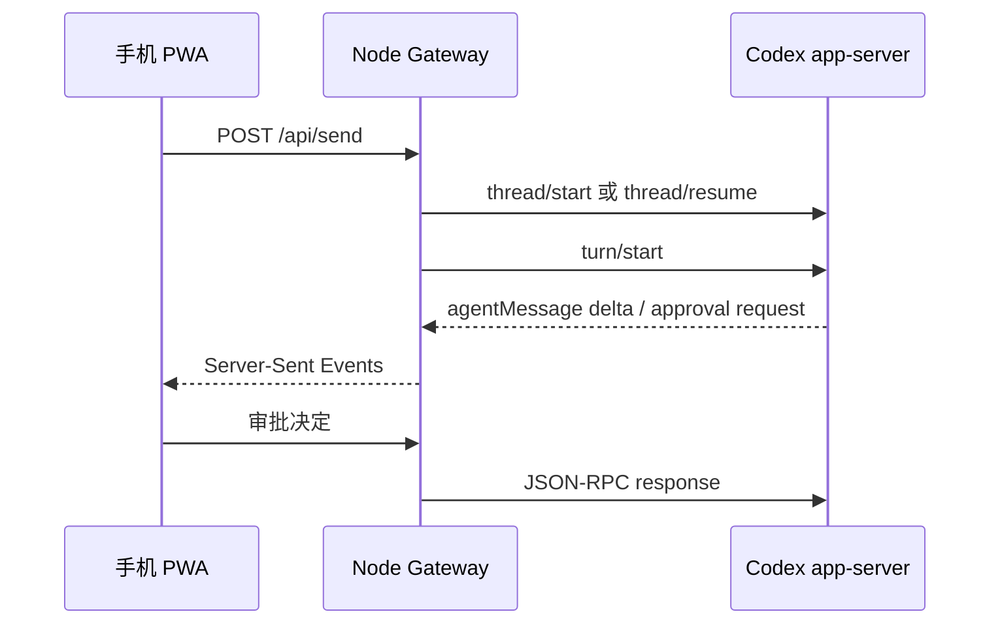

# 架构与数据流

## 组件

1. 手机 PWA：发送文本、附件、审批决定，切换权限、工作目录和主机。
2. Tailscale Serve：终止 HTTPS，并只向 Tailnet 成员开放。
3. Node.js Gateway：固定监听 `127.0.0.1`，校验配对会话并管理上传文件。
4. Codex app-server：由 Gateway 作为子进程启动，通过逐行 JSON-RPC 通信。
5. Codex 本机配置：API Key、provider、模型目录、任务数据库和插件均由 Codex
   自己读取，Gateway 不复制这些秘密。
6. code-server（可选）：只监听 `127.0.0.1:8080`，由 Tailscale Serve 的 Tailnet-only
   HTTPS `8443` 发布，提供该系统用户权限范围内的文件编辑和终端。

## 任务流程

## 多主机联邦

每台主机独立运行完整的 Tailscale Serve、Gateway 和 Codex app-server。`hosts` 只是所有主机共享的
导航目录，网页切换主机时使用顶层页面跳转，不会由当前 Gateway 通过 SSH 或 HTTP 代理另一台主机。

这样可以保持以下边界：

- 每台主机使用自己的 Codex API Key、provider 配置和任务数据库。
- 每台主机使用自己的配对码、签名 Cookie、上传目录和权限状态。
- 一台主机离线不会使其他主机失去控制能力。
- 首次打开每个主机域名时，需要分别输入该主机的配对码。

`GET /api/public-config` 只返回主机名称和 Tailnet HTTPS 地址，目的是让登录页也能切换主机。它不返回
工作目录、Codex 配置、配对码或其他私有运行数据。

## 任务发现与工作目录切换

`workspaces` 是管理员在 `config.json` 中配置的新任务起始目录。Gateway 还会通过
`thread/list` 分页发现本机未归档任务的真实 `cwd`，用于全局任务列表、关键词搜索和目录筛选。

恢复历史任务前，Gateway 会调用 `thread/read` 读取该任务记录的真实 `cwd`，确认目录仍存在后才把它加入
当前运行时工作区。手机不能提交一个任意路径来冒充任务目录。

切换目录时 Gateway 会：

1. 拒绝在 turn、审批或上传进行期间切换。
2. 清空当前 thread 选择和消息视图，防止把旧任务继续到新 cwd。
3. 将权限恢复为 `workspace`。
4. 将选择写入私有数据目录的 `active-workspace.txt`。
5. 让后续新建任务和 `writableRoots` 使用新目录。

## 附件

- 上传原件保存在私有数据目录的 `uploads/` 中，权限为当前用户可读写。
- 图片作为 `localImage` 输入传给 Codex。
- 其他文件通过本机绝对路径告知 Codex，由其按需读取。
- Gateway 会清理文件名并校验附件 ID，防止路径穿越。

## 回复中的本机图片

助手消息由浏览器端安全 Markdown 渲染器构建 DOM，不执行回复中的 HTML。绝对图片路径会重写为
认证接口 `/api/local-file`。Gateway 对请求执行以下检查：

1. 路径必须是绝对路径并指向普通文件。
2. `realpath` 必须位于固定工作区、已发现任务目录或 `fileRoots` 内。
3. 文件头必须匹配 JPEG、PNG、GIF、WebP 或 AVIF。
4. 响应使用 `nosniff`、私有缓存和沙箱 CSP。

## 权限模式

`workspace`：

- sandbox 为 `workspace-write`
- 工作目录来自 `config.json` 的 `workspaces` 白名单
- 需要时向手机请求审批

`full`：

- sandbox 为 `danger-full-access`
- approval policy 为 `never`
- 只保存在进程内存中，Gateway 重启后恢复为 `workspace`

## 持久数据

数据目录包含：

- `pairing-code.txt`
- `cookie-secret.txt`
- `gateway.log`
- `active-workspace.txt`
- `uploads/`

这些文件都不应提交到版本控制。
